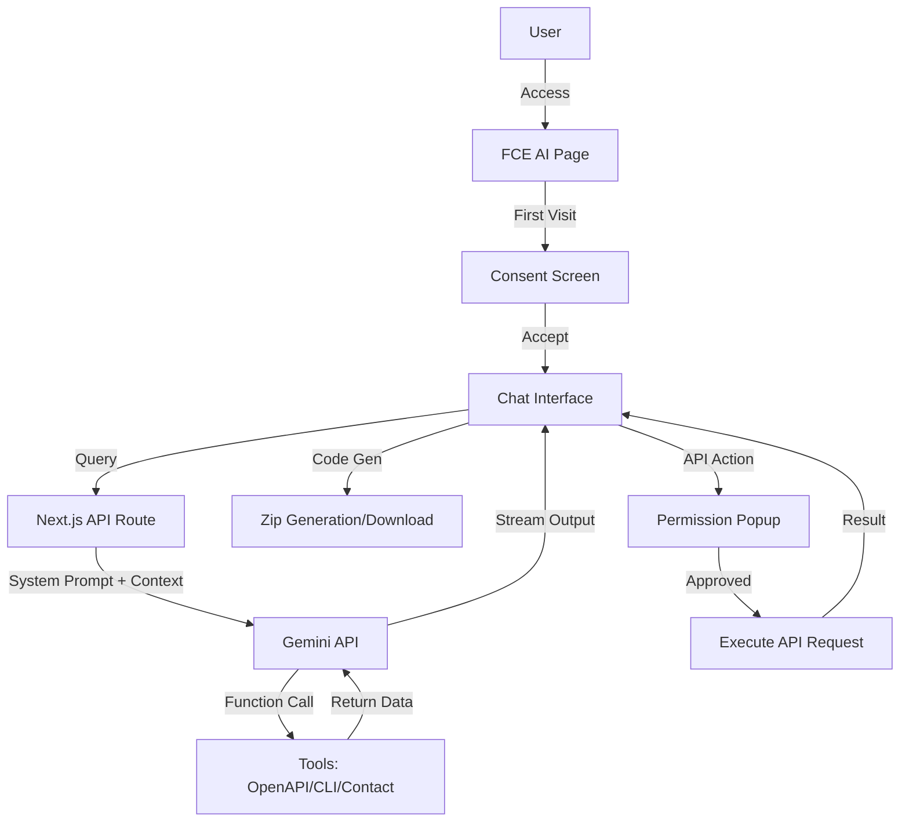

# FCE AI Integration Plan

This plan outlines the integration of **FCE AI** (FreeCustom.Email AI) into the platform, leveraging the latest **Gemini 2.x** models and **@google/genai** SDK.

## 1. Overview
FCE AI is a specialized assistant for developers, providing:
- Intelligent support using `openapi.yaml` and CLI documentation.
- Multi-language automation code generation (single or multi-file zip).
- Native API capabilities: `create_api_key`, `perform_api_request`, etc.
- Support integration: Robust contact request handling.

## 2. Technical Architecture

### 2.1 Backend: Hybrid Model Routing
A new route `app/api/ai/chat/route.ts` will implement the core logic using `@google/genai`.
- **SDK**: `@google/genai` (Unified SDK for Gemini 2.x).
- **Dynamic Routing**:
  - **gemini-2.5-flash** (Default): For fast, low-latency responses and simple tasks.
  - **gemini-2.5-pro** (Advanced): Automatically triggered for complex logic, multi-file code generation, or long context tasks.
- **Streaming**: Native readable stream implementation for the best UX.

### 2.2 Knowledge & Tooling (Function Calling)
Instead of large system prompts, we use **Function Calling** for dynamic retrieval:
- `get_api_specs(endpoint)`: Fetches specific schema/details from `public/openapi.yaml`.
- `get_cli_docs(command)`: Fetches relevant sections from `/api/cli`.
- `get_email_tool_info()`: Provides knowledge about the main email box tool.
- `handle_contact_request(name, email, message)`: Triggers the `/api/contact` endpoint securely.
- `create_api_key()` & `perform_api_request()`: Triggers a **frontend permission popup** before backend execution.

## 3. User Experience Flows

### 3.1 Initial Consent
Users see a modal explaining:
- Personalization using their name/email.
- Ability to send contact requests.
- Ability to perform API requests on their behalf.
- Privacy assurance (FCE cannot read conversations, powered by Gemini).

### 3.2 API Permission Popup
When the AI wants to call an API (e.g., `create_api_key` or a mailbox action):
1. AI pauses generation.
2. A popup appears: "FCE AI wants to [Action Description]. Allow?"
3. User clicks "Allow" or "Deny".
4. Result is fed back to the AI.

## 4. Integration Points
- **DevHeader**: Add "FCE AI" button/link.
- **AppFooter**: Add "FCE AI" under Developers column.
- **API Overview (`/api`)**: Prominent "Ask FCE AI" button.
- **CLI Page (`/api/cli`)**: Inline "Ask FCE AI about CLI" button.
- **Playground**: Integrated chat sidebar or button.

## 5. File Structure
- `app/[locale]/ai/page.tsx`: Main AI interface page.
- `app/api/ai/chat/route.ts`: API handler for Gemini.
- `components/ai/FceAiInterface.tsx`: The chat UI.
- `components/ai/ConsentModal.tsx`: Privacy & terms modal.
- `components/ai/PermissionPopup.tsx`: API action confirmation.
- `lib/ai/prompts.ts`: System prompts and tool definitions.
- `lib/ai/utils.ts`: Zip generation, stream parsing, etc.

## 6. Mermaid Diagram

## 7. Next Steps
1. Switch to Code mode.
2. Set up Gemini API environment variables.
3. Implement the backend route with tool definitions.
4. Build the frontend interface with streaming and memory management.
5. Integrate into existing pages.
