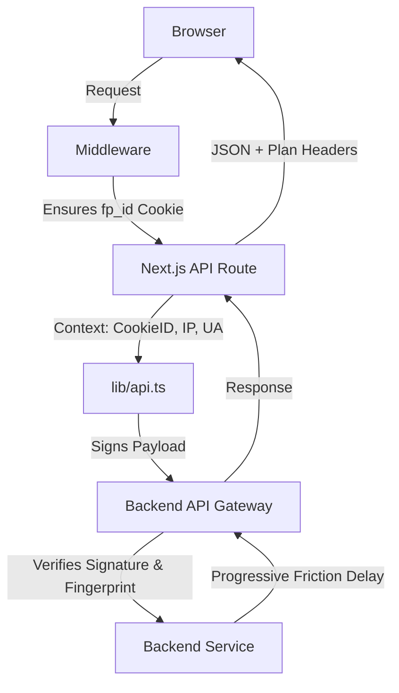

# Frontend Security Migration Plan

The goal is to update the Next.js frontend to comply with the new contextual, identity-aware security architecture of the Maildrop backend.

## 1. Security Utilities (`lib/security.ts`)
- Implement `generateFingerprint(req: NextRequest | Request, cookieId: string)`:
  - Extract IP (with `x-forwarded-for` fallback), User-Agent, Timezone, and Accept-Language.
  - Return SHA-256 hash.
- Implement `generateSignature(path: string, method: string, timestamp: string, body?: any)`:
  - Format: `${timestamp}.${method}.${path}.${JSON.stringify(body) || ''}`
  - Sign using `process.env.INTERNAL_API_SECRET` via HMAC-SHA256.

## 2. Middleware Update (`middleware.ts`)
- Check for `fp_id` cookie in incoming requests.
- If missing, generate a new UUID.
- Append the cookie to the response using `NextResponse`.

## 3. Central API Utility (`lib/api.ts`)
- Refactor `fetchFromServiceAPI` and `fetchFromServiceAPIWithStatus`:
  - Require a `context` parameter (containing `fp_id`, `userId`, and request details like IP/UA).
  - Include mandatory headers:
    - `x-internal-api-key`
    - `x-signature`
    - `x-timestamp`
    - `x-nonce`
    - `x-fp`
    - `x-cookie-id`
    - `x-user-id`
  - Increase fetch timeout to **5 seconds** for progressive friction.

## 4. API Route Audit
- Update existing routes in `app/api/**/*` to pass the necessary context to `lib/api.ts`.
- Ensure all calls to the backend are server-side only.

## 5. UI/UX Enhancements
- Audit frontend components for loading states (skeletons/spinners) to handle artificial latency.
- Implement/trigger an "Upgrade Modal" when a `429 Too Many Requests` is received.

## 6. Plan Logic
- Update components that rely on user plan state to fetch from `GET /api/user/me` (which should now use the secure backend call) or read the `x-derived-plan` header.

## Mermaid Flow: Secure Request Path

